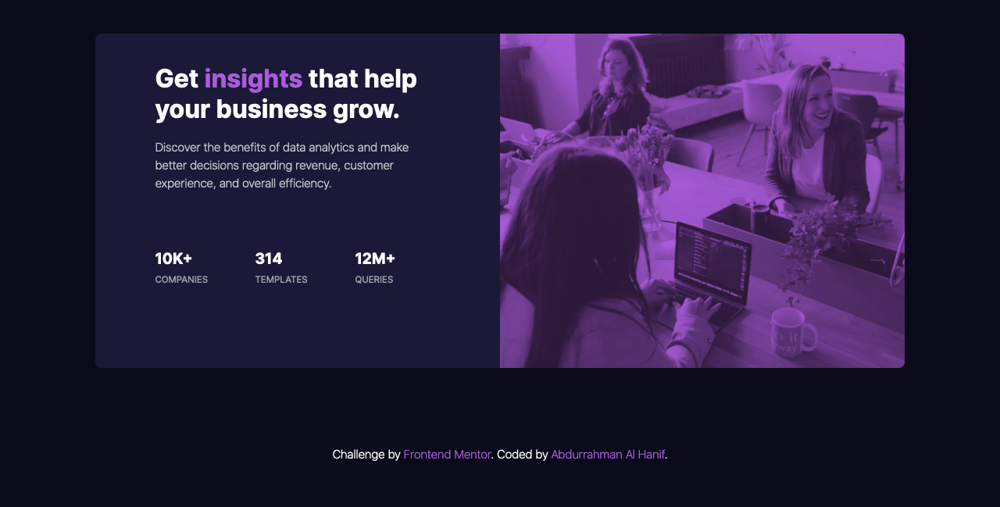

# Frontend Mentor - Stats preview card component solution

This is a solution to the [Stats preview card component challenge on Frontend Mentor](https://www.frontendmentor.io/challenges/stats-preview-card-component-8JqbgoU62). Frontend Mentor challenges help you improve your coding skills by building realistic projects. 

## Table of contents

- [Overview](#overview)
  - [The challenge](#the-challenge)
  - [Screenshot](#screenshot)
  - [Links](#links)
- [My process](#my-process)
- [Author](#author)

**Note: Delete this note and update the table of contents based on what sections you keep.**

## Overview

### The challenge

Users should be able to:

- View the optimal layout depending on their device's screen size

### Screenshot

### Links

- [Solution](https://github.com/unip/fm-stats-component)
- [Live Site](https://unip.github.io/fm-stats-component/)

## My process

First, analyzing how the html markup will I make from the design image. Then start to make the markup with mobile first workflow. After that, I make a new SCSS file and compile it to be a pure css to make the style readable by browser. Then uploaded it on Github and publish it with Github Page.

### Built with

- Semantic HTML5 markup
- Bootstrap 5
- SASS
- Flexbox
- CSS variable
- Media query
- CSS blending mode
- Mobile-first workflow

## Author

- Website - [unipstudio](https://unipstudio.com)
- Frontend Mentor - [@unip](https://www.frontendmentor.io/profile/unip)
- Twitter - [@hellounip](https://www.twitter.com/hellounip)
